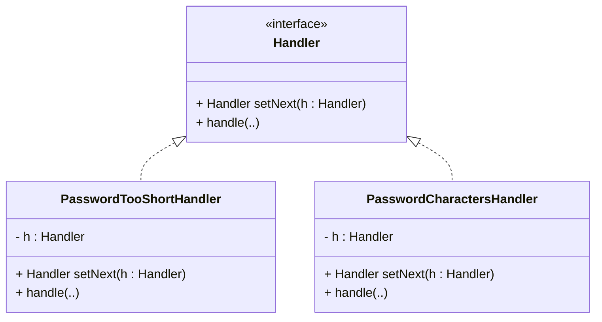
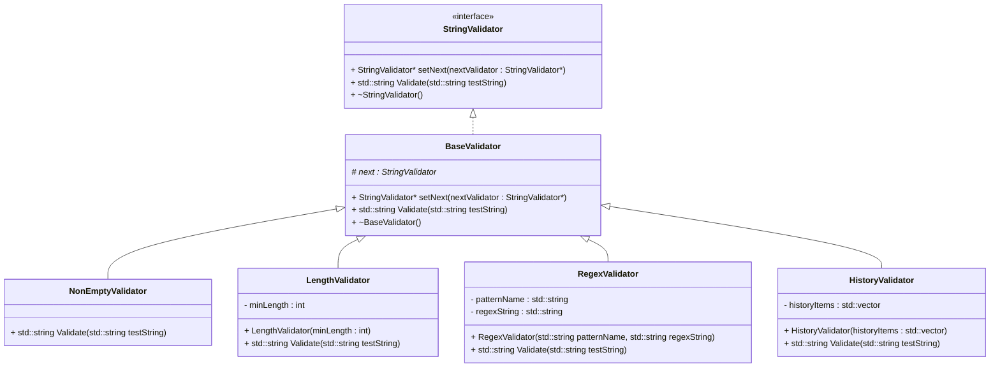

## 1. Chain of Responsibility

Examples:
- Various levels of authentication
- Validate a string given as input

#### Naive approach : 

Using if else or nested if else.

:x: Problem 
- What if we want to do the same thing for password
- Or if we want to change the order !

#### :heavy_check_mark: Solution : 
- Represent sequential check marks as a chain of handlers (or objects)!
- Each handler handles the situation or passes on the responsibility to the next handler.

#### Example

