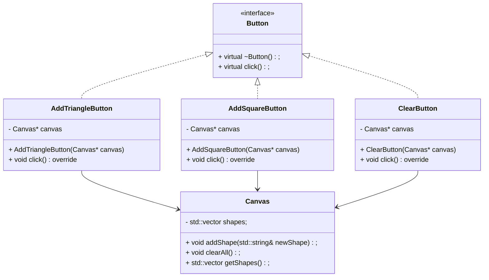
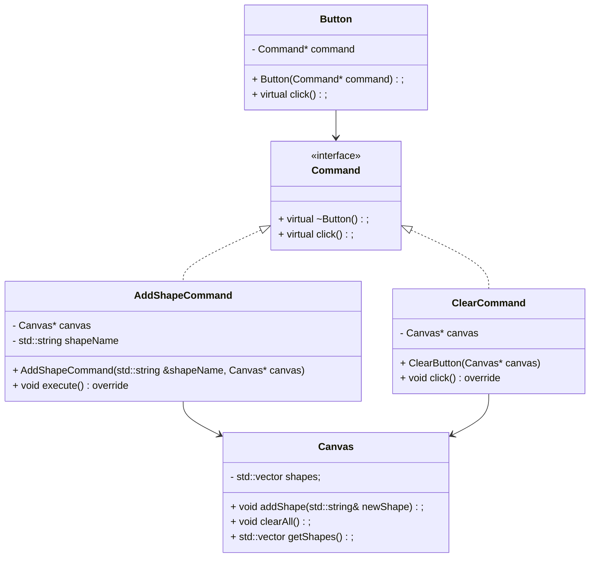

### Initial design

#### Problem:
- If we want to duplicate the functionality of say AddTriangleButton.. then we need to duplicate the code in to a new subclass.
- All of them contain reference to a `Canvas`, so limited to canvas only.

### Solution :

