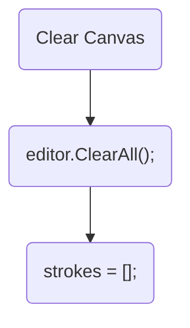
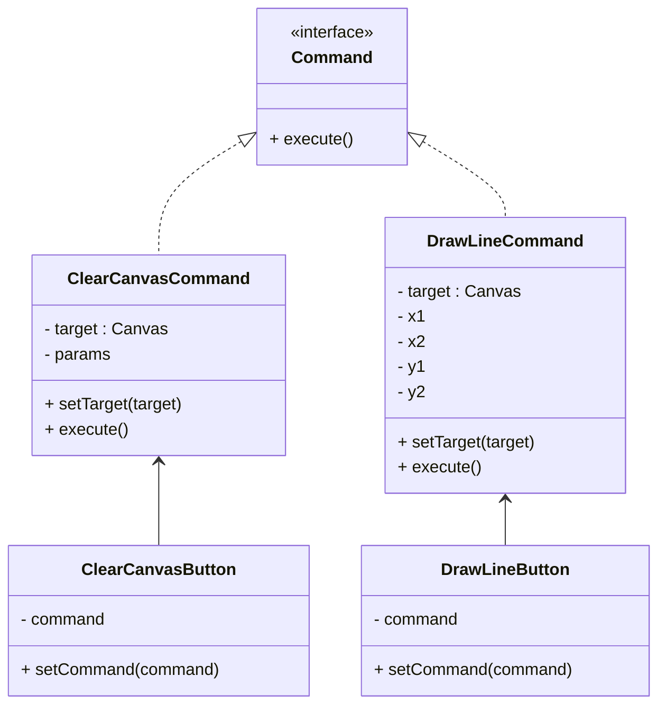

## 2. Command Pattern

#### When should I use the command pattern?
Use this pattern to reduce coupling between classes that call one another and make functionality more reusable between similar classes.

#### Example situation 

- Clear canvas button needs to clear figures in the canvas.
- Calls done

- **Problem:** 
    - Forms tight coupling between different pieces of code
    - Buttons know about the canvas.

#### :heavy_check_mark: Solution

- Represent events or changes that can occur in our program as their own classes, which implement a common command interface.

