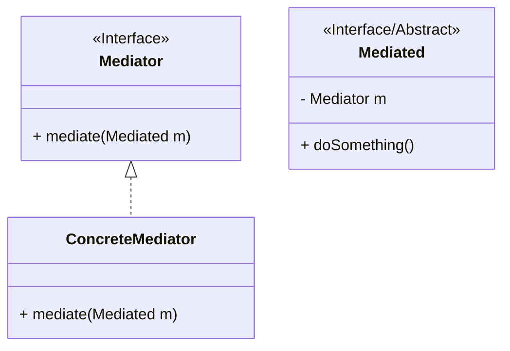
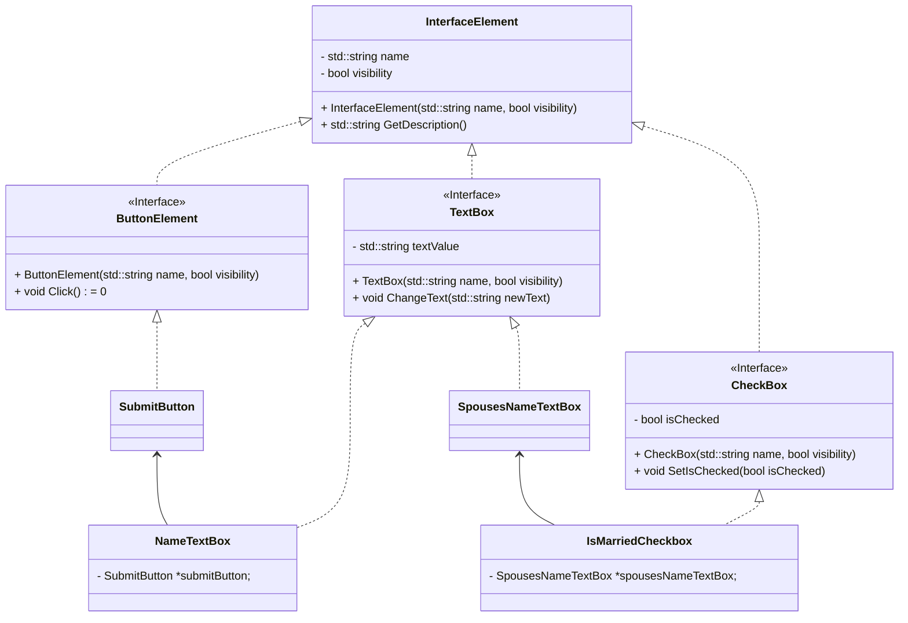
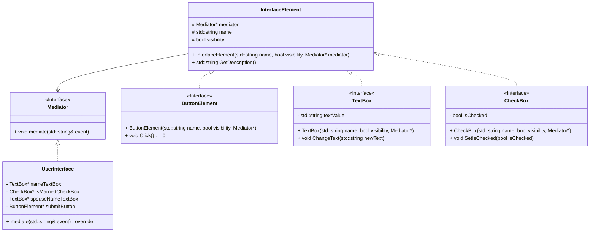

## Mediator

### Problem
Consider a form, 

* First Name
* Last Name
* Employment Status
* Marital Status

Now, if the person is employed.. then add few more ...
* Employer Name
* Position Title
* Number of years at the company

If married
* Spouse's First Name
* Spouse's Last Name

**This creates complex dependency of Text boxes on the logic, We can not reuse the text box, if we want to reuse it.**

### The mediator patterns' solution

*Instead of having each class know about other classes, create a mediator object that manages all the relationships between these classes.*

