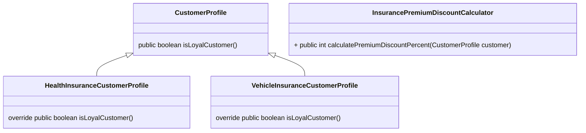

# DesignPatternsCPP

## 1. Single Responsiblity Principle

- Every software component should have one and only one responsibility
  - `Component` can be a class, method, or a module.
- E.g: Swiss army knife - Software component should not be like this!

**Every software component should have one and only one ~~responsibility~~ reason to change.**

### Cohesion 

_It is the degree to which the various parts of a software components are related._  
  
E.g : Scattered Garbage (low cohesion) -> Segregated garbage bin bags (high cohesion)

```java
public class Square {
  int side = 5;
  
  // --- High cohesion between calculateArea and calculatePerimeter
  public int calculateArea() {
    return side * side;
  }
  
  public int calculatePerimeter() {
    return 4 * side;
  }
  
  // --- High cohesion between draw and rotate
  public void draw() {
    if (hightResolutionMonitor) {
      // Reder a high resolution image
    }
    else {
      // Render a normal resolution image
    }
  }
  
  public void rotate(int degree) {
    // rotate the image to required degree and re render
  }
}
```

```java
public class Square {
  int side = 5;
  public int calculateArea() {
    return side * side;
  }
  
  public int calculatePerimeter() {
    return 4 * side;
  }
}

public class SquareUI {

  public void draw() {
    if (hightResolutionMonitor) {
      // Reder a high resolution image
    }
    else {
      // Render a normal resolution image
    }
  }
  
  public void rotate(int degree) {
    // rotate the image to required degree and re render
  }
}
```
**Square:** Responsibility of measurement of squares  
**SquareUI:** Responsibility of rendering images of squares.  

> ✔️**NOTE:** _"Higher cohesion helps attain better adherence to the single responsiblity principle"_


### Coupling

_"Coupling is defined as the level of inter dependency between various software components"_

E.g: Train is tightly coupled to it's rail, but not in Software components.

```java
public class Student {
  private String studentId;
  private Date studentDOB;
  private String address;
  
  // --- Tightly coupled to database here !
  public void save() {
    // Serialize object in to string
    String objectStr = MyUtils.serializeIntoAString(this);
    Connection connection = null;
    Statement stmt = null;
    try {
      Class.forName("com.mysql.jdbc.Driver");
      connection = DriverManager.getconnection("jdbc:mysql://localhost:3306/MyDB", "root", "password");
      stmt = connection.createStatement();
      stmt.execute("INSERT INTO STUDENT VALUES (" + objectStr + ")");
    }
    catch (Exception e ) {
      e.printStackTrace();
    }
  }
  
  public String getStudentId() {
    return studentId;
  }
  
  public void setStudentId(String studentId) {
    this.studentId = studentId;
  }
}
```
Splitting the code : 

```java
// Reasons to change : Change in student profile
public class Student {
  private String studentId;
  private Date studentDOB;
  private String address;
  
  public void save() {
    new StudentRepository().save(this);
  }
  
  public String getStudentId() {
    return studentId;
  }
  
  public void setStudentId(String studentId) {
    this.studentId = studentId;
  }
}

// Reasons to change : Change in database.
public class StudentRepository {
  public void save(Student student) {
    // Serialize object in to string
    String objectStr = MyUtils.serializeIntoAString(student);
    Connection connection = null;
    Statement stmt = null;
    try {
      Class.forName("com.mysql.jdbc.Driver");
      connection = DriverManager.getconnection("jdbc:mysql://localhost:3306/MyDB", "root", "password");
      stmt = connection.createStatement();
      stmt.execute("INSERT INTO STUDENT VALUES (" + objectStr + ")");
    }
    catch (Exception e ) {
      e.printStackTrace();
    }
  }
}
```

**Student:** Responsibility to handle core student profile data  
**StudentRepository:** Responsibility to handle database operations  

> ✔️**NOTE:** _"Loose coupling helps attain better adherence to the Single Responsibility Principle."_

***

## 2. Open closed Principle

_"Software Components should be closed for modification, but open for extension._

E.g : To add any feature, we did not do any change in the hardware of the existing console. But made it possible to add new features (extensions) like steering, guns. etc. 

**Closed for modification :**
- New features getting added to the sofware component, should NOT have to modify the existing code.

**Open for extension:**
- A software component should be extendable to add a new feature or to add a new behaviour to it. 


_**One State Insurance - For all your health insurance needs.**_
```java
public class InsurancePremiumDiscountCalculator {
  public int CalculatePremiumDiscountPercent(HealthInsuranceCustomerProfile customer) {
    if (customer.isLoyalCustomer()) {
      return 20;
    }
    return 0;
  }
}

public class HealthInsuranceCustomerProfile {
  public boolean isLoyalCustomer() {
    return true; // or false
  }
}
```

One State insurance acquires a vehicle insurance company...   

_**One State Insurance - For all your health and vehicle insurance needs.**_

Add a method and an overloaded method  
```java
public class VehicleInsuranceCustomerProfile {
  public boolean isLoyalCustomer() {
    return true; // or false
  }
}

public class InsurancePremiumDiscountCalculator {
  public int CalculatePremiumDiscountPercent(HealthInsuranceCustomerProfile customer) {
    if (customer.isLoyalCustomer()) {
      return 20;
    }
    return 0;
  }
  
  public int CalculatePremiumDiscountPercent(VehicleInsuranceCustomerProfile customer) {
    if (customer.isLoyalCustomer()) {
      return 20;
    }
    return 0;
  }
}
```

**Refactor to have a base class**



Now, if we need to say add another for Home insurance.. we do not need to modify any existing code. We just need to add an extra class `HomeInsuranceCustomerProfile`

### Takeaways
- Ease of adding new features
- Leads to minimal cost of developing and testing software.
- Open Closed Principle often requires decoupling, which in turn, automatically follows single responsibility principle.


***

## 3. Liskov Substitution Principle


