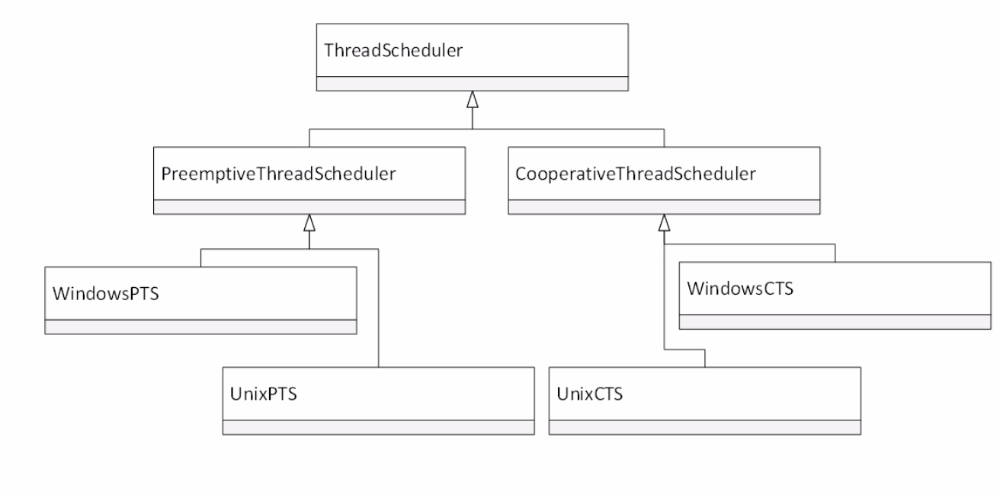
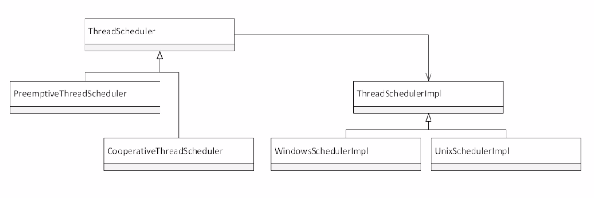

#  Bridge Pattern

A mechanism that decouples an interface (hierarchy) from an implementation (hierarchy).

### Example :

If i need to add another Operating system mac, then I need to add two classes one for 'Preemptive' and another for 'Cooperative'.

Now, add only one class by implementing 'ThreadSchedulerImpl'

## PImpl Idiom

Serves as foundation for bridge pattern.

## Shape sizing demo

Shape and Renderer

## Notes

* Decouple abstraction from implementation.
* Both can exist a hierarchies.
* A stronger from of encapsulation.

