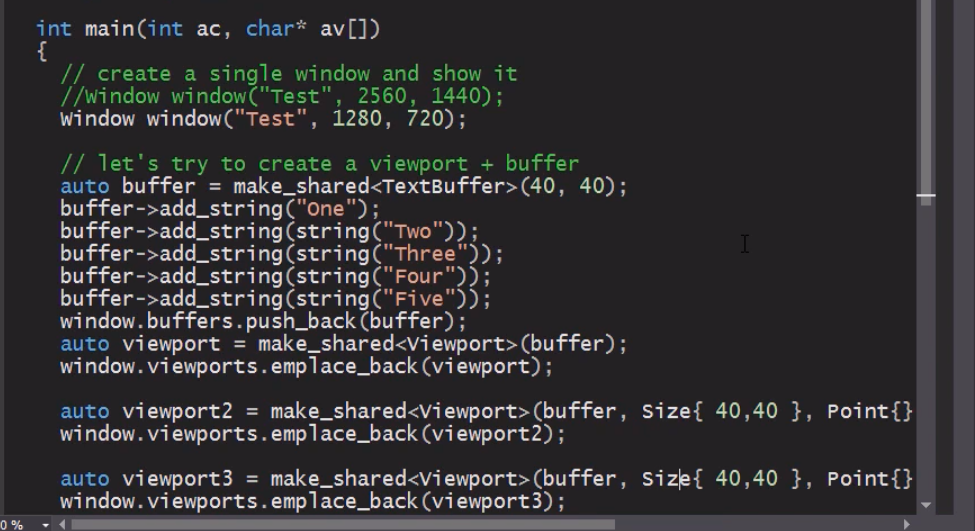

#  Facade pattern

Balancing complexity and presentation/usability.
End users not exposed to internals.

**Provides a simple, easy to understand / use interface over a large and sophisticated body of code.**
 
* Make a library easier to use and test
* Reduce dependencies of user code on internal API that may change. 
* * Allows more flexibility in developing/refactoring the library.
* Wrap a poorly designed collection of APIs with a single well-designed API

main function is constructing from the low level elements. 

## Notes

* Build a facade to provide a simplified API over a set of classes.
* May wish to (optionally) expose internals through the facade.
* May allow users to 'escalate' to use more complex APIs if they need to.
